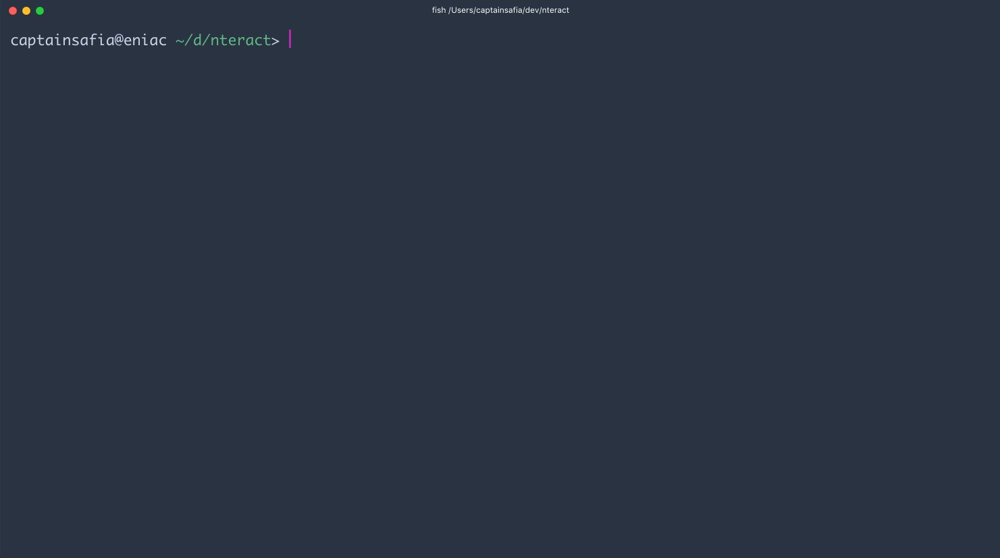

# dossier
dossier is a command line utility that generates a report from any git repository
that utilizes the [Conventional Changelog Standard](https://github.com/bcoe/conventional-changelog-standard/blob/master/convention.md). Currently, dossier generates the following statistics:

- Commit counts by prefix
- Top contributor by prefix
- Most frequent commit date by prefix

If you're interested in seeing more statistics reflected in dossier, you can
submit an issue.

### Installation

```
npm install --global @captainsafia/dossier
```

### Usage

```
  Usage: dossier [options]

  Options:

    -h, --help          output usage information
    -V, --version       output the version number
    -c, --commits <n>   Number of commits to analyze
    -p, --prefixes <l>  Conventional changelog prefixes used
```


